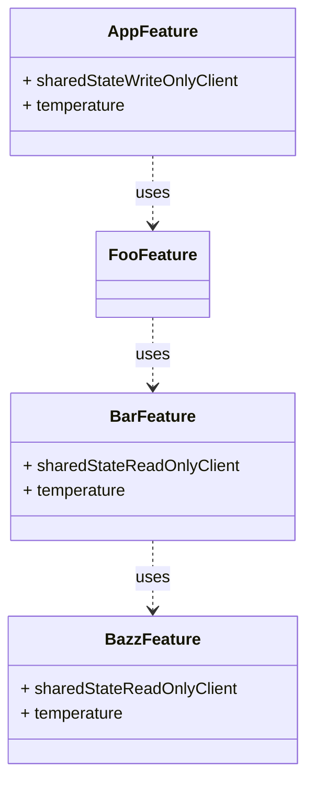

# TCA Shared State Ergonomics

## Problem

Sharing global state across a feature hierarchy in a TCA application can be
difficult. The problem is that sharing global state requires propagating the
shared state across all features on the path from the application feature to
the child feature that requires it. This also requires that each feature adds a
computed property for creating the next child feature's state from the shared
state along with the other state belonging to the child feature. Finally, to
support this pattern this also requires that each parent feature store the
child feature's properties loosely which increases the size and complexity of
the parent feature's state.

## Solution

Instead of adding boilerplate to push state down the feature hierarchy, and to
help organize feature state properties, we can use the `@Dependency` property
wrapper to create a shortcut. Each feature requiring global state can simply
inject the "shared state" via a client made available through the environment.
Note: this is simply a shortcut - the application state is still the single
source of truth.

## Example

The structure of the example:

- `AppFeature` contains and manages the `temperature`
- `FooFeature` shows a sheet containing `BarFeature`
- `BarFeature` shows the current temperature and shows `BazFeature` inline
- `BazzFeature` shows the current temperature (a second client to show that
  multiple clients are supported)

The source of truth is `AppFeature` which is responsible for updating the
`temperature` state. After fetching and updating the temperature it publishes
the value to the `ShareStateWriteOnlyClient`. This client allows writing of new
values only.

Child features which need the `temperature` value retrieve it from the
environment by using the `SharedStateReadOnlyClient`. This client allows
reading of new values only.

